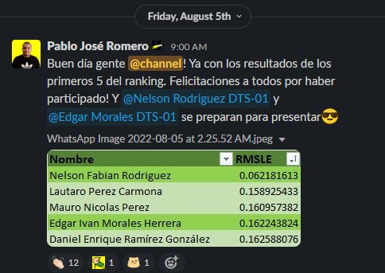

# Henry-Hackathon
Hello, world. This repo summarizes my submission for the Henry Hackathon, a 4-day machine learning challenge at the end of the Data Science bootcamp I undertook at Henry. The problem was simple: given a csv file (house_train_raw.csv) that contains data related to properties for sale during a certain period in a specified location, we had to devolpe a model that predicts the property price. Then, we had to use another csv file (houses_test_raw.csv) to generate the prediction (house_price_predictions.csv) and submit it to the organizers for scoring.

The file H01.ipynb contains the notebook with all the code and developing process, but in summary, I took the following steps:

1. Importing libraries
2. Loading data
3. Exploratory analysis
4. Data processing
5. Modeling
6. Evaluation and tuning
7. Predicting

At the end of the hackathon, I got a score of 0.162588076 which got me in the Top 5 :)

PS: The comments in the file are in Spanish, my native language. If you have any questions, just hit me up at urbdaniel.86@gmail.com

Best,

Danny Ramirez
